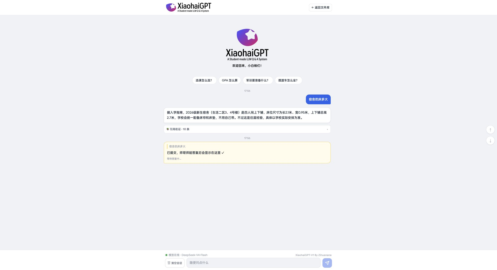
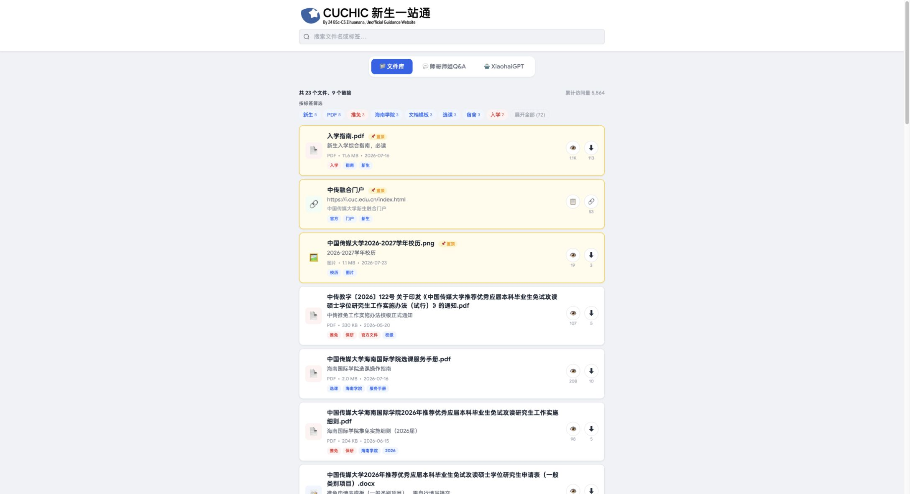
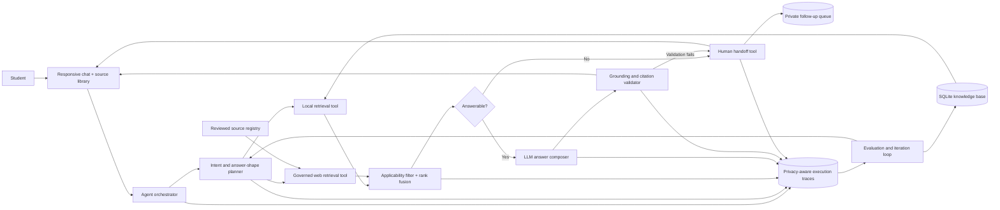

# Campus Onboarding Copilot

An evidence-grounded AI customer service agent for incoming university students.
It turns fragmented FAQs, policy documents, service manuals, and student
experience into cited answers, while escalating unresolved cases for human
follow-up.

> **Live experience:** [XiaohaiGPT student demo](https://hic.zihuanana.top/xiaohaigpt.html)<br>
> **Source library:** [HIC onboarding portal](https://hic.zihuanana.top/)<br>
> The live experience runs the experimental `xiaohaigpt` branch. The reviewed
> RAG, evaluation, tracing, and deployment baseline lives on `main`.

This is an independent student-built project, not an official university
service. Users should verify time-sensitive policies against the latest school
notice.

## Product in action

### Grounded answer and unresolved-case handoff



The student-facing experience answers from retrieved evidence, exposes the
supporting-source drawer, and keeps a human-response state in the same
conversation when the case needs follow-up.

### Searchable source library



The assistant does not replace source access. Students can still search and
browse the underlying policies, manuals, forms, links, and peer-maintained
resources directly.

## The customer-service problem

Incoming students repeatedly ask questions such as:

- “How many people share a dorm room?”
- “How do I complete new-student information collection?”
- “What are the course add/drop rules?”
- “What should I do if the available documents do not answer my case?”

The information exists, but is distributed across formal policies, service
manuals, student-maintained FAQs, spreadsheets, attachments, and changing web
pages. A fluent chatbot alone is unsafe: official rules and peer experience
have different authority, documents may be stale, and some questions require a
human rather than a generated answer.

The product goal is therefore **end-to-end issue resolution**, not answer
generation alone:

1. understand the student's intent and context;
2. retrieve the most applicable evidence;
3. decide whether the evidence is sufficient to answer;
4. compose and validate a grounded response;
5. expose sources and uncertainty;
6. route unresolved cases to a human queue;
7. turn failed queries into evaluation and knowledge-base improvements.

## Product experience

| Stage | Student experience | Agent behavior |
| --- | --- | --- |
| Ask | Natural-language, multi-turn chat | Classifies the question and resolves explicit follow-ups |
| Find | No need to know document names | Searches local knowledge and, when governed, reviewed web sources |
| Answer | Direct response followed by supporting sources | Separates official policy, official guidance, public context, and peer experience |
| Verify | Visible citations and unresolved boundaries | Validates citations, authority, applicability, and refusal rules |
| Escalate | Optional email follow-up when self-service fails | Stores a redacted query, trace ID, and opt-in contact in a private queue |
| Improve | Better coverage over time | Operators inspect failure traces and convert repeated gaps into corpus or product work |

## System architecture



The LLM is an answer composer—not the knowledge base, retrieval judge, or final
authority. The application can fall back to an auditable local composer when a
model is unavailable or its response fails validation.

## How one query is resolved

```text
question + student profile + recent turns
  → query contextualization
  → question type and required-answer planning
  → applicability filters
  → FTS5 lexical retrieval + local subword retrieval
  → reciprocal-rank fusion and coverage reranking
  → optional allowlisted official/public web retrieval
  → answerability decision
  → evidence packet for the LLM
  → claim/citation/authority validation
  → answer with sources OR refusal and human handoff
  → trace for evaluation
```

### Why hybrid retrieval

- **FTS5 lexical retrieval** preserves exact policy terms, form names, dates,
  course types, and document numbers.
- **Local hashed subword retrieval** adds a reproducible offline similarity
  channel for Chinese phrasing variations.
- **Reciprocal-rank fusion** combines both candidate lists without hiding the
  retrieval logic behind a single opaque score.
- **Applicability metadata** keeps cohort, academic year, student level, major,
  and campus attached to every chunk.
- **Authority metadata** controls how evidence may be stated. A directly
  relevant student measurement can answer a lifestyle question, but must be
  labeled as peer experience rather than school policy.

SQLite is the inspectable MVP system of record. The logical `documents` and
`chunks` model can later move to PostgreSQL/pgvector without changing the
evidence contract.

## Knowledge and SOP integration

The ingestion pipeline is source-aware rather than a universal fixed-token
splitter:

| Source type | Retrieval unit | Control |
| --- | --- | --- |
| FAQ | Complete question and answer | Preserves scope and caveats |
| Policy/handbook | Heading-aware paragraphs | Retains conditions, exceptions, page, and effective date |
| Service manual/SOP | Ordered steps | Preserves executable procedure sequence |
| Safe student measurement | One structured item | Makes each fact independently citable |
| Form/link | Action or resource | Never treated as policy evidence |
| Image/scanned PDF | Non-assertable until parsed | Prevents filenames from masquerading as facts |
| Personal-record spreadsheet | Quarantined | Prevents private records from entering retrieval |

Official-site synchronization and per-query web retrieval are intentionally
separate. New or changed official pages remain `pending` until reviewed; a
checksum change invalidates the previous approval.

## Agent controls and failure handling

The planner routes a request through one of four evidence paths:

1. `local_knowledge`
2. `official_web_discovery`
3. `public_web_discovery`
4. `official_and_public_web_discovery`

Before generation, the system assigns an explicit answerability state such as
`supported`, `experience_only`, `supported_with_context`,
`supported_with_unresolved_wording`, or `insufficient_official_evidence`.
Unsupported factual generation is blocked.

After generation, the validator checks that:

- every citation exists in the supplied evidence packet;
- policy claims use assertable official evidence;
- peer evidence remains labeled as experience;
- uncertainty and applicability are not silently removed;
- a refusal is preserved when `can_generate=false`.

Full natural-language entailment checking is not yet implemented; this README
does not claim otherwise.

## Evaluation framework

The project treats evaluation as a product loop, not a one-time model score.
No production-quality metric is reported until a sufficiently large,
human-labeled test set exists.

| Layer | Metric or check | Product question |
| --- | --- | --- |
| Retrieval | Recall@K, MRR, source-type and applicability match | Did the agent find the right evidence? |
| Grounding | Citation validity, claim-evidence linkage, unsupported-claim rate | Is the answer supported by what was retrieved? |
| Resolution | Self-service resolution rate, handoff rate, repeat-contact rate | Did the student's issue reach a useful endpoint? |
| Service quality | Completeness, correctness, clarity, policy/experience labeling | Was the resolution trustworthy and usable? |
| User outcome | Explicit helpfulness/CSAT and task completion | Did the student feel helped and complete the next step? |
| Operations | Latency, provider/fallback rate, failure taxonomy, cost per resolved case | Can the service run reliably and economically? |
| Safety | PII leakage, stale-policy use, invalid authority escalation | Did the agent stay within its operating boundary? |

The repository currently includes labeled retrieval questions and chat-contract
checks for citation, refusal, authority, and response shape. The next evaluation
step is to sample real failed queries, label root causes, and build held-out
scenario sets around the highest-volume intents.

### Query trace for case analysis

Each chat request produces a privacy-aware trace containing:

- redacted user query and contextualized retrieval query;
- local and web candidates, including rejected evidence;
- selected evidence and answerability decision;
- provider, model, and fallback path;
- grounding result, final answer, citations, errors, and stage latency;
- environment and request source for separating evaluation from real traffic.

It deliberately excludes hidden model reasoning, credentials, cookies, and
authorization headers. Common emails, phone numbers, and long identifiers are
redacted; session identifiers are one-way hashed. Production traces and opt-in
handoffs default to 30-day retention.

```bash
campus-copilot traces list --environment production --source browser --limit 50
campus-copilot traces show trace_<id>
campus-copilot handoffs list --limit 50
```

## Product decisions and trade-offs

| Decision | Why now | Planned evolution |
| --- | --- | --- |
| Evidence-first orchestration | Fluent output must not conceal weak retrieval | Add claim-level entailment and temporal-conflict evaluation |
| SQLite + inspectable hybrid search | Small, batch-updated corpus; exact terms matter; easy to audit | Migrate to PostgreSQL/pgvector when measured scale requires it |
| Human handoff as a first-class outcome | “I don't know” alone does not resolve a support case | Add ownership, status, SLA, and resolution feedback to the queue |
| Provider-neutral LLM adapter | Avoid model lock-in and preserve fallback | Compare providers on quality, latency, availability, and cost |
| Reviewed-source web access | Freshness matters, but open-web authority is risky | Add a reviewed mainland-China search/official-account adapter |
| Bounded in-memory conversation | Minimizes privacy and account complexity in the MVP | Persist history only with identity, isolation, consent, and retention controls |

## Repository and branch strategy

| Branch | Role | Status |
| --- | --- | --- |
| `main` | Reviewed RAG, answerability, evaluation, tracing, handoff, and single-server deployment baseline | Stable integration source |
| `xiaohaigpt` | Student-facing live experience with additional admin/knowledge workflows and senior Q&A | Experimental; capabilities return to `main` only through scoped, tested PRs |

The original HIC onboarding knowledge base and public source site are created
and maintained by **Zihuanana**. **Pengwei Fu** designed and implemented the
retrieval, grounded-generation, evaluation, cloud-model integration, trace,
handoff, and deployment layers in this repository. Collaboration follows
issues, independent branches, reviewed pull requests, and explicit ownership
boundaries; the live branch is not presented as if every feature already exists
on `main`.

## Interview demo walkthrough

Use three questions to show different agent behaviors:

1. **Peer experience:** `宿舍是几人间，能确定吗？`<br>
   Inspect how student experience is retrieved, labeled, and qualified.
2. **Official procedure:** `新生第一次选课怎么操作？`<br>
   Inspect ordered SOP evidence, applicability, and citations.
3. **Coverage gap:** ask a current rule that the corpus cannot directly prove.<br>
   Inspect the refusal boundary, human-handoff offer, and execution trace.

For each case, discuss the same PM loop: user intent → evidence/tool choice →
answerability → response or handoff → trace → evaluation label → next product
iteration.

## Run locally

```bash
python3 -m venv .venv
.venv/bin/pip install -e '.[parsers,dev]'

make sync          # synchronize the public demo corpus
make build         # normalize, chunk, and index
make audit         # inspect provenance, privacy, parsing, and freshness gaps
make evaluate      # run labeled retrieval checks
make evaluate-chat # run grounding and refusal contract checks
make serve         # open http://127.0.0.1:8000
```

The provider interface accepts OpenAI-compatible chat-completions endpoints,
including DeepSeek or an AI gateway. Credentials live only in ignored local or
server environment files; the no-key local composer keeps the full path
runnable.

Useful APIs:

```text
GET  /api/health
GET  /api/corpus/stats
GET  /api/library
POST /api/search
POST /api/context
POST /api/chat
POST /api/session/reset
```

Example retrieval request:

```bash
curl -s http://127.0.0.1:8000/api/search \
  -H 'content-type: application/json' \
  -d '{"query":"宿舍是几人间","profile":{"cohort":"2026"}}'
```

See [`docs/KNOWLEDGE_MODEL.md`](docs/KNOWLEDGE_MODEL.md) for the indexing
decisions, [`docs/LLM_INTEGRATION.md`](docs/LLM_INTEGRATION.md) for the model
contract, and [`deploy/README.md`](deploy/README.md) for the reviewed Tencent
Cloud single-server deployment.

## Current boundary and roadmap

The current corpus is a useful seed, not a complete official source of truth.
The immediate roadmap is driven by observed support failures:

1. establish a human-labeled intent and resolution benchmark from real queries;
2. add claim-level entailment and temporal-conflict evaluation;
3. close high-volume knowledge gaps and add official-account ingestion;
4. turn handoff into a tracked resolution workflow with owner, SLA, and outcome;
5. experiment with retrieval, prompts, and conversation strategy using offline
   gates before controlled online A/B tests;
6. add structured actions/tool calling only after factual-answer reliability is
   established.

Code and synchronized content licensing are still being documented. Treat the
repository as private and do not redistribute the source corpus until those
boundaries are confirmed.
