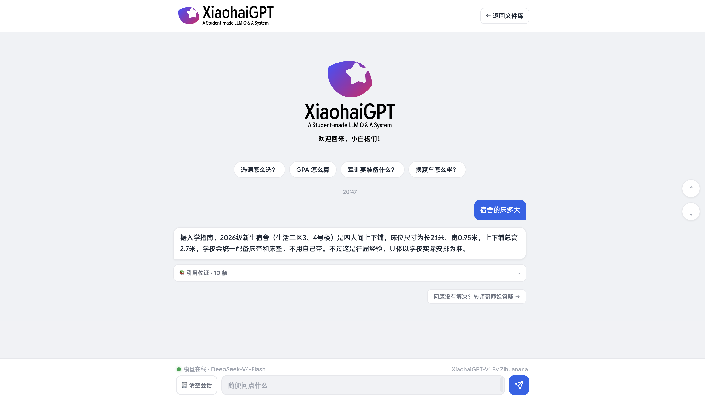
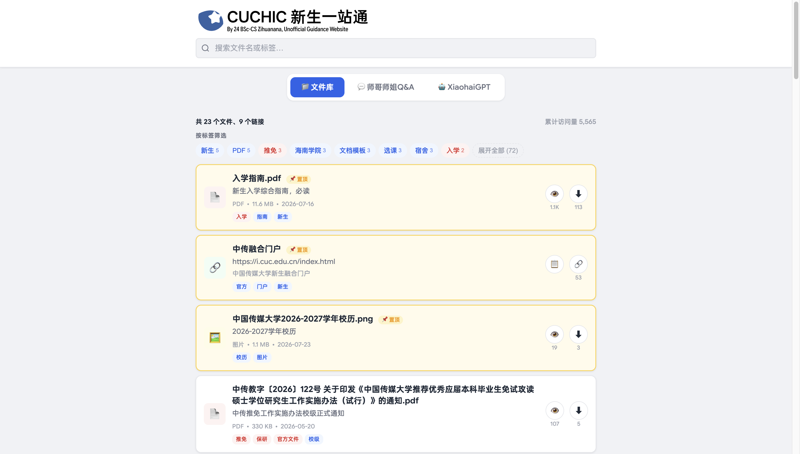
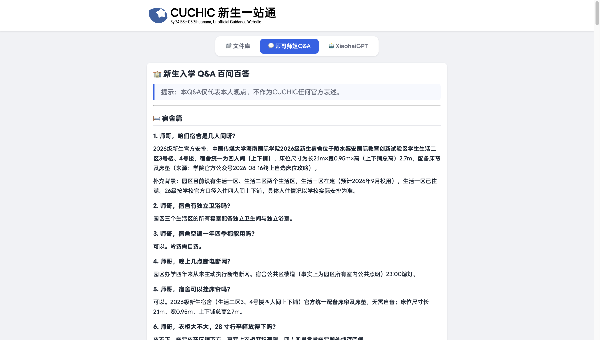
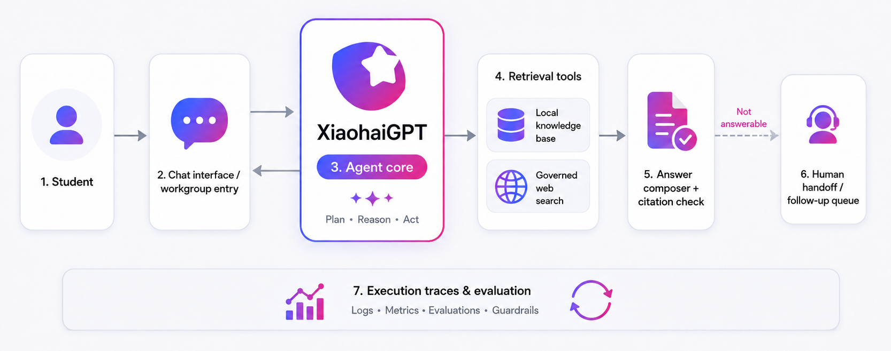

# Campus Onboarding Copilot

Campus Onboarding Copilot is an evidence-grounded AI customer service agent for
incoming university students. It retrieves information from policies, service
manuals, FAQs, student guides, and reviewed web sources; produces cited
answers; and routes unresolved cases to a human follow-up queue.

> **Live application:** [XiaohaiGPT](https://hic.zihuanana.top/xiaohaigpt.html)<br>
> **Source library:** [HIC onboarding portal](https://hic.zihuanana.top/)<br>
> The live application runs the experimental `xiaohaigpt` branch. `main`
> contains the reviewed RAG, evaluation, tracing, handoff, and deployment
> baseline documented below.

This is an independent student project. Time-sensitive policies should be
verified against the latest university notice.

## Product overview

Incoming students often know the question they need answered without knowing
which document, department, or terminology contains the answer. Relevant
information is spread across formal policies, service manuals, attachments,
student-maintained FAQs, spreadsheets, and frequently updated webpages.

The Copilot organizes this support journey into seven steps:

1. interpret the question with recent conversation context;
2. identify the required answer type and student applicability;
3. retrieve evidence from the local corpus and approved web sources;
4. assess whether the available evidence can support an answer;
5. compose and validate the response;
6. offer human follow-up when coverage is insufficient;
7. record a privacy-aware trace for evaluation and iteration.

### Core capabilities

| Capability | Implementation |
| --- | --- |
| Multi-turn support | Bounded conversation context with fresh retrieval on every turn |
| Hybrid retrieval | SQLite FTS5, local hashed subword vectors, reciprocal-rank fusion, and coverage reranking |
| Knowledge governance | Provenance, authority, dates, applicability, checksums, parse status, and review state |
| Grounded generation | Versioned evidence packet, structured claims, citations, and post-generation validation |
| Retrieval tools | Local knowledge, governed official web retrieval, and optional public web discovery |
| Human handoff | Opt-in follow-up queue linked to the redacted query and execution trace |
| Observability | Candidate evidence, selection decisions, fallback path, validation result, errors, and latency |
| Deployment | Docker Compose, Caddy HTTPS, health checks, persistent runtime volume, and rate limiting |

## Product interface

### Grounded answer and human follow-up



The response states the source boundary, provides a supporting-evidence drawer,
and keeps the escalation action next to the answer. This makes verification and
follow-up part of the same support flow.

### Searchable source library





Students retain direct access to the underlying files and curated Q&A. The
library also gives operators a visible view of the corpus that powers the
assistant.

## System architecture



The agent core plans the evidence route, invokes retrieval tools, and passes a
bounded context packet to the answer composer. The validation layer checks
citations and source policy before the response reaches the user. Unanswerable
requests enter the follow-up queue. Execution traces support offline analysis,
evaluation, and guardrail development across the complete path.

## Request lifecycle

```text
question + student profile + recent turns
  → query contextualization
  → question type and answer-shape planning
  → applicability filters
  → FTS5 lexical retrieval + local subword retrieval
  → reciprocal-rank fusion and coverage reranking
  → optional allowlisted official/public web retrieval
  → answerability decision
  → evidence packet for the LLM
  → claim, citation, and authority validation
  → grounded response or human handoff
  → execution trace and evaluation
```

The model receives the planned query, response policy, answerability state, and
ranked evidence objects. Retrieval and source-policy decisions remain in the
application layer. When the provider is unavailable or its output fails
validation, an extractive local composer keeps the request path operational.

## Knowledge and retrieval

### Document model

SQLite is the inspectable system of record for the current corpus:

- `documents` stores provenance, authority, dates, applicability, checksums,
  and parse status;
- `chunks` stores meaning-preserving retrieval units and citation locations;
- `chunk_fts` provides lexical retrieval over Chinese n-grams, titles,
  headings, and tags;
- local hashed subword vectors provide a second offline candidate list;
- reciprocal-rank fusion combines lexical and subword rankings before coverage
  and applicability reranking.

This design keeps source lineage visible during development and review. The
logical document and chunk model can later move to PostgreSQL and pgvector as
traffic, concurrent writes, or embedding requirements grow.

### Source-aware chunking

| Source | Retrieval unit | Policy |
| --- | --- | --- |
| FAQ | Complete question and answer | Preserves scope and caveats |
| Policy or handbook | Heading-aware paragraphs | Retains conditions, exceptions, page, and effective date |
| Service manual or SOP | Ordered steps | Preserves procedure sequence |
| Safe student measurement | One structured item | Makes each fact independently citable |
| Form or link | Resource/action record | Offered as a next step, excluded from policy claims |
| Image or scanned PDF | Metadata until successful parsing | Excluded from factual answers while content is unavailable |
| Personal-record spreadsheet | Quarantined | Excluded from indexing and public retrieval |

### Source authority and answerability

Every evidence object carries an authority type and assertion policy. Official
policy can support formal rules; official guidance can support a procedure;
peer material is presented as student experience; public web material supplies
general context.

Before generation, the planner assigns an answerability state such as
`supported`, `experience_only`, `supported_with_context`,
`supported_with_unresolved_wording`, or `insufficient_official_evidence`.
Generation proceeds only when the evidence satisfies the required answer
aspects.

Official-site synchronization and per-request web retrieval use separate
workflows. New or changed official pages enter a review queue, and a checksum
change resets the previous approval before the content can return to the local
index.

## Response validation and handoff

The post-generation validator currently enforces these contracts:

- every citation resolves to evidence supplied for the current request;
- factual claims remain linked to cited evidence IDs;
- policy claims use an assertable official source;
- peer evidence retains its student-experience label;
- uncertainty and student applicability remain visible;
- an insufficient-evidence decision returns a refusal and follow-up route.

Claim-level natural-language entailment and temporal-conflict detection remain
planned work.

When the evidence cannot support a useful conclusion, the client offers an
optional email follow-up. The private queue stores the redacted query, trace ID,
and submitted address. Contact information stays outside the model context and
knowledge index.

## Evaluation and observability

Evaluation covers retrieval quality, response quality, customer-service
outcomes, reliability, and safety. Production metrics will be reported after a
sufficiently large human-labeled set is available.

| Layer | Metric or check | Purpose |
| --- | --- | --- |
| Retrieval | Recall@K, MRR, source-type match, applicability match | Measure evidence discovery |
| Grounding | Citation validity, claim-evidence linkage, unsupported-claim rate | Measure factual support |
| Resolution | Self-service resolution, handoff, and repeat-contact rates | Measure issue completion |
| Service quality | Correctness, completeness, clarity, and source labeling | Measure answer usefulness |
| User outcome | Helpfulness/CSAT and task completion | Measure student experience |
| Operations | Stage latency, provider/fallback rate, error class, cost per resolution | Measure service health |
| Safety | PII leakage, stale-policy use, authority escalation | Measure guardrail performance |

The repository includes labeled retrieval cases and chat-contract checks for
citations, refusals, authority, and response shape. Each chat request also
produces a trace with:

- redacted and contextualized queries;
- local and web candidates, including rejected evidence;
- selected evidence and answerability decision;
- provider, model, and fallback path;
- validation result, final answer, citations, errors, and stage latency;
- environment and request source for separating evaluation traffic from real
  browser sessions.

Traces exclude model credentials, cookies, authorization headers, and hidden
model reasoning. Common emails, phone numbers, and long identifiers are
redacted; session identifiers are one-way hashed. Production traces and opt-in
handoffs use a 30-day default retention period.

```bash
campus-copilot traces list --environment production --source browser --limit 50
campus-copilot traces show trace_<id>
campus-copilot handoffs list --limit 50
```

## Getting started

### Requirements

- Python 3.9 or later
- `make`
- network access for corpus synchronization
- optional model and search credentials for provider-backed generation and web
  discovery

### Install and run

```bash
git clone git@github.com:cuchic-community-lab/campus-onboarding-copilot.git
cd campus-onboarding-copilot

python3 -m venv .venv
.venv/bin/pip install -e '.[parsers,dev]'

make sync
make build
make audit
make serve
```

Open [http://127.0.0.1:8000](http://127.0.0.1:8000).

`make sync` downloads the public demo manifest and files. `make build`
normalizes, chunks, and indexes the corpus. Optional DOCX/XLSX parsers are
included by the installation command above.

### Configuration

Copy the example file and keep the populated file untracked:

```bash
cp .env.example .env.local
```

| Variable | Required | Description |
| --- | --- | --- |
| `CAMPUS_LLM_PROVIDER` | For model generation | Provider preset or provider label |
| `CAMPUS_LLM_API_KEY` | For model generation | Server-side model credential |
| `CAMPUS_LLM_BASE_URL` | For custom provider | OpenAI-compatible `/v1` endpoint |
| `CAMPUS_LLM_MODEL` | For custom provider | Model identifier |
| `CAMPUS_LLM_TIMEOUT` | No | Provider timeout in seconds; default `30` |
| `CAMPUS_WEB_SEARCH_PROVIDER` | For autonomous discovery | Search-provider adapter; development supports `tavily` |
| `CAMPUS_WEB_SEARCH_API_KEY` | For autonomous discovery | Separate search credential |
| `CAMPUS_WEB_SEARCH_TIMEOUT` | No | Search timeout in seconds; default `12` |
| `CAMPUS_TRACE_ENABLED` | No | Enables local execution tracing; default `1` |
| `CAMPUS_TRACE_RETENTION_DAYS` | No | Trace and handoff retention; default `30` |
| `CAMPUS_ENVIRONMENT` | No | Trace environment label; default `development` |

The included Makers preset supplies its gateway URL and model name. Any
OpenAI-compatible endpoint can be configured through the base URL, model, and
API key variables. With no model credential, the application uses its local
composer.

### Useful commands

```bash
make query Q="宿舍是几人间，能确定吗？"
make chat Q="新生第一次选课怎么操作？"
make evaluate
make evaluate-chat
make publication-audit
make test
```

## API

| Method | Path | Purpose |
| --- | --- | --- |
| `GET` | `/api/health` | Runtime, database, model, and search readiness |
| `GET` | `/api/corpus/stats` | Indexed corpus summary |
| `GET` | `/api/library` | Public projection of synchronized resources |
| `GET` | `/files/<filename>` | Allowlisted manifest attachment |
| `POST` | `/api/search` | Retrieval candidates and scoring metadata |
| `POST` | `/api/context` | Model-ready evidence packet and answer plan |
| `POST` | `/api/chat` | Grounded response, sources, and trace ID |
| `POST` | `/api/session/reset` | Clear the current bounded conversation |

Example retrieval request:

```bash
curl -s http://127.0.0.1:8000/api/search \
  -H 'content-type: application/json' \
  -d '{"query":"宿舍是几人间","profile":{"cohort":"2026"}}'
```

## Testing and quality gates

```bash
make test
make evaluate
make evaluate-chat
make audit
make publication-audit
```

- unit tests cover retrieval, planning, composition, source policy, web
  retrieval, tracing, handoff, preview security, frontend contracts, and
  deployment configuration;
- retrieval evaluation uses labeled questions in
  `evaluation/golden_questions.jsonl`;
- chat evaluation checks citation, refusal, authority, and answer-shape
  contracts;
- publication audit rejects tracked secrets and private/generated corpus files.

## Production deployment

The reviewed beta deployment uses one Tencent Cloud Lighthouse or CVM instance,
Docker Compose, and Caddy. The application container runs without root
privileges; Caddy terminates HTTPS; a named volume persists traces and handoff
records across releases.

Production credentials belong in the ignored `deploy/.env.production` file.
Port `8000` remains private, while Caddy exposes ports `80` and `443`.

See [`deploy/README.md`](deploy/README.md) for provisioning, startup, backup,
upgrade, and release-gate instructions.

## Repository layout

```text
src/campus_copilot/       agent planning, retrieval, composition, tracing, API
config/                   governed web and official-crawl registries
evaluation/               labeled retrieval scenarios
web/                      student-facing responsive client
tests/                    unit and contract tests
docs/                     knowledge model, LLM contract, collaboration notes
deploy/                   Docker/Caddy production configuration and runbook
data/                     reviewed seed corpus and ignored runtime artifacts
```

## Project status and collaboration

| Branch | Role | Status |
| --- | --- | --- |
| `main` | RAG, answerability, evaluation, tracing, handoff, and single-server deployment baseline | Reviewed integration branch |
| `xiaohaigpt` | Live student experience, admin/knowledge workflows, and senior Q&A | Experimental integration branch |

Capabilities move from `xiaohaigpt` to `main` through scoped pull requests with
tests and review. See [`CONTRIBUTING.md`](CONTRIBUTING.md) and
[`docs/COLLABORATION.md`](docs/COLLABORATION.md) for the shared workflow.

The original HIC onboarding knowledge base and public source site are created
and maintained by **Zihuanana**. **Pengwei Fu** designed and implemented the
retrieval, grounded generation, evaluation, cloud-model integration, tracing,
handoff, and production deployment layers in this repository.

## Roadmap

- build a larger human-labeled benchmark from real query failures;
- add claim-level entailment and temporal-conflict evaluation;
- expand reviewed official-site and official-account coverage;
- add owner, status, SLA, and resolution outcome to the handoff workflow;
- compare retrieval, prompt, and conversation-strategy changes through offline
  gates and controlled experiments;
- introduce structured action tools after the factual support path meets its
  quality threshold.

## Data and licensing boundary

The current corpus covers a limited set of onboarding scenarios. QR-based
communities and privacy-sensitive record spreadsheets remain outside the index.
Code and synchronized content licensing are still under review, so repository
access and corpus redistribution remain restricted until those terms are
documented.
